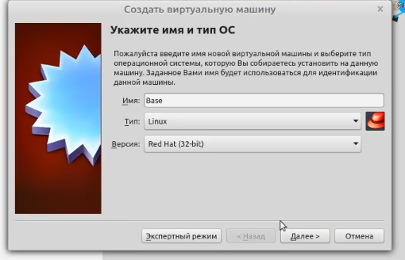
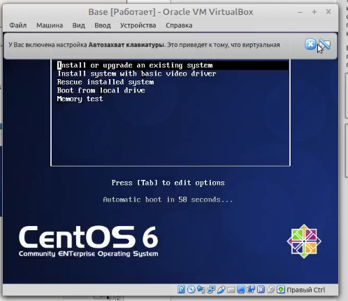
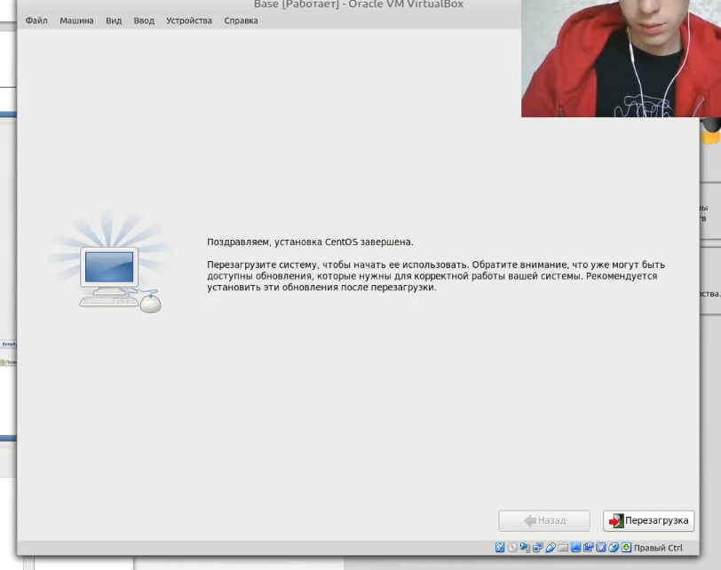
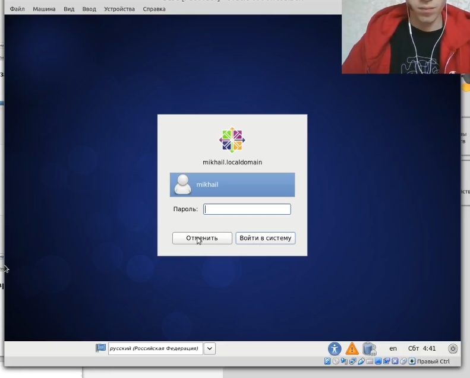
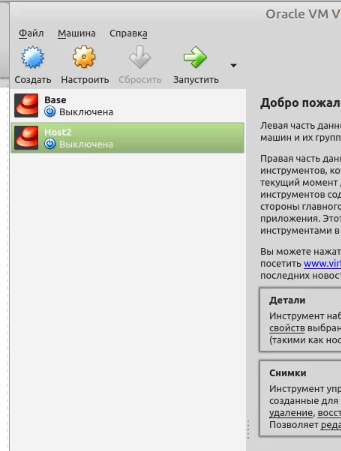

---
## Front matter
lang: ru-RU
title: Лабораторная работа №1
author: |
	Бешкуров Михаил - студент группы НКНбд-01-18
date: 15.09.2021

## Formatting
toc: false
slide_level: 2
theme: metropolis
header-includes: 
 - \metroset{progressbar=frametitle,sectionpage=progressbar,numbering=fraction}
 - '\makeatletter'
 - '\beamer@ignorenonframefalse'
 - '\makeatother'
aspectratio: 43
section-titles: true
---

# Установка и конфигурация операционной системы на виртуальную машину"

## Прагматика выполнения

- Виртуальная машина является практичным инструментом, позволяющим эмулировать различные сложные системы, тестировать различные ОС и т.д.
Для продуктивной работы с ней необходимо знать приципы ее работы.

## Цель выполнения лабораторной работы

- Приобретение практических навыков установки операционной системы на виртуальную машину, настройки минимально необходимых для дальнейшей работы сервисов.

## Задачи выолнения работы

- Проверить настройки VirtualBox. Создать новую вирутальную машину Base.
- Запустить виртуальную машину Base. Провести ее конфигурацию.
- Подключиться к вирутальной машине, используя созданную учетную записью.
- Создать на основе виртуальной машины Base машину Host2.

## Результаты выполнения лабораторной работы

- После проверки настроек VirtualBox была создана новая виртуальная машина Base (рис -@fig:001)

{ #fig:001 width=70% }

##

- Была запущена виртуальная машина Base и проведена ее конфигурация (рис -@fig:002, рис -@fig:003)

{ #fig:002 width=70% }

##

{ #fig:003 width=70% }

##

- Было произведено подключение к виртуальной машине с использованием созданной учетной записи \textit{rvivanov} (рис -@fig:004)

{ #fig:004 width=70% }

##

- На основе виртуальной машины Base была создана машина Host2 (рис -@fig:005)

{ #fig:005 width=70% }

##

Таким образом, я приобрел практические навыки установки операционной системы на виртуальную машину, настройки минимально необходимых для дальнейшей работы сервисов.
