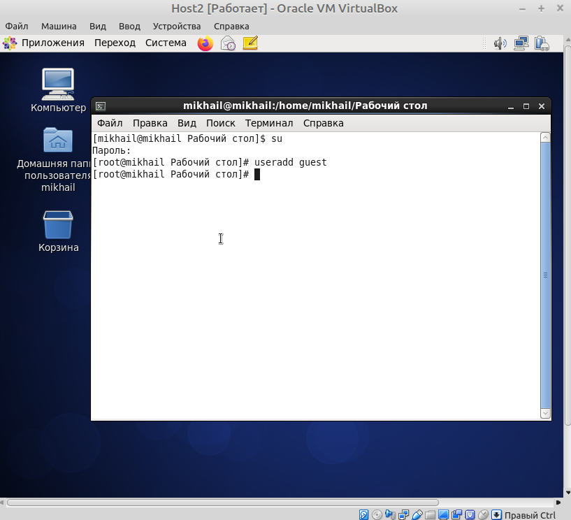
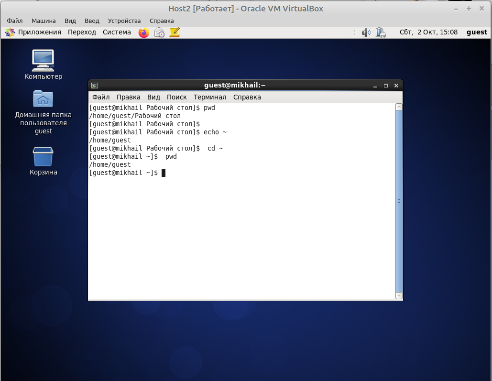
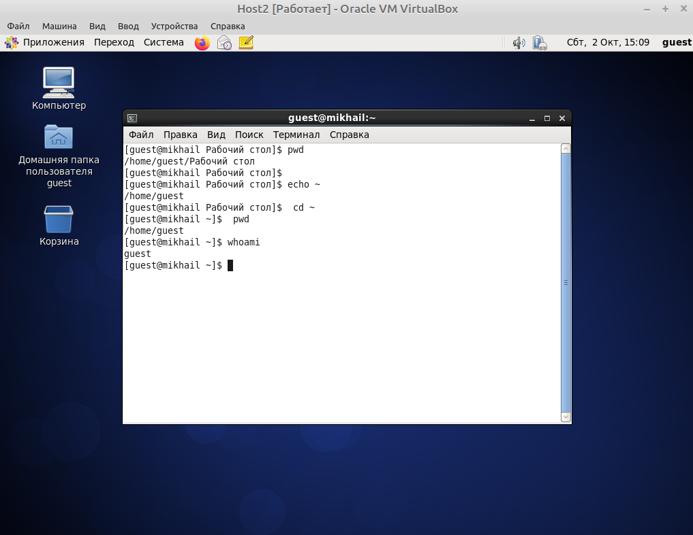
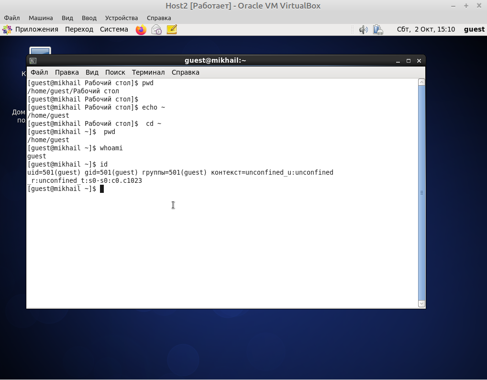
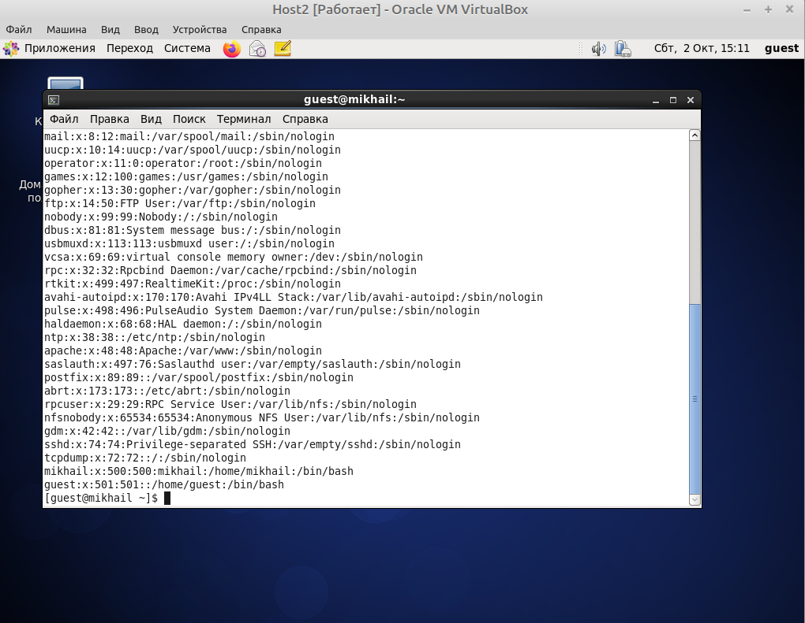
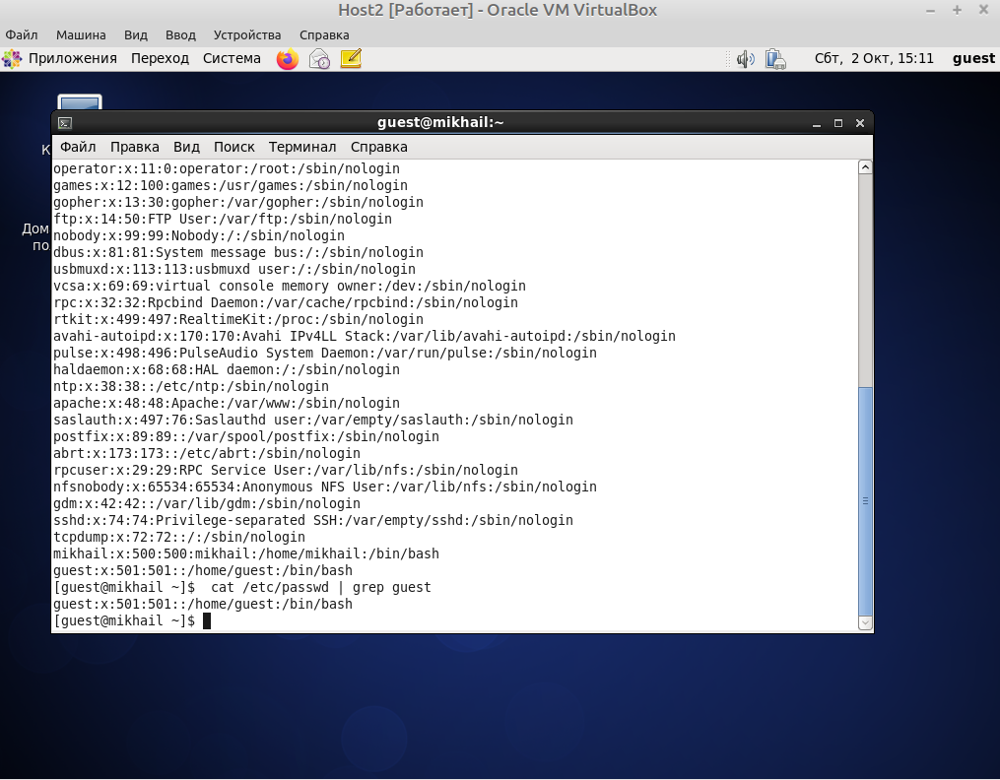
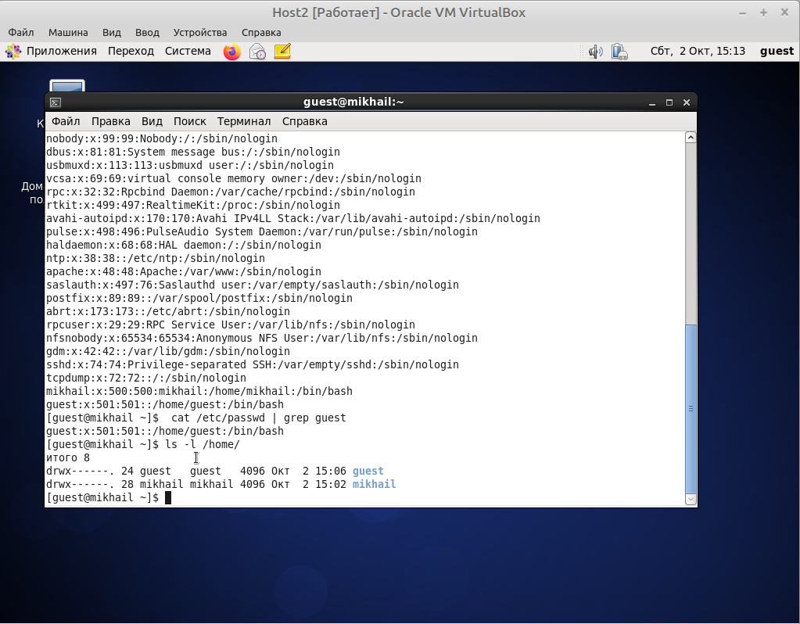
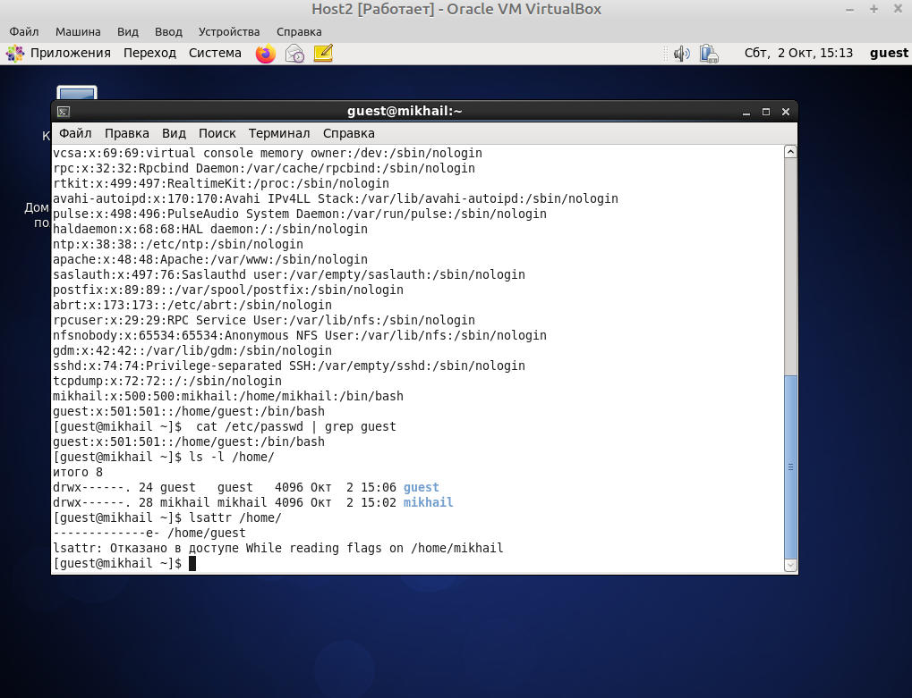
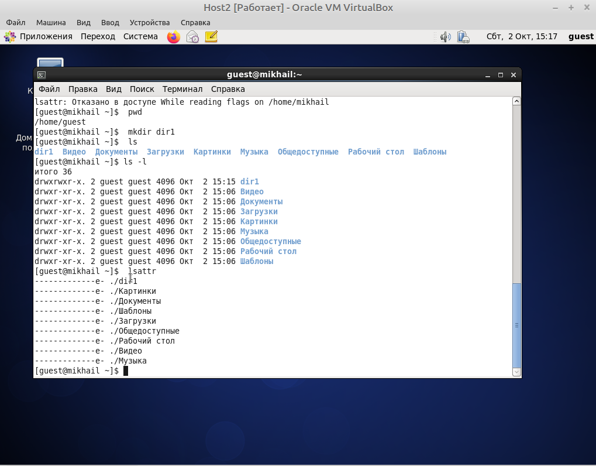
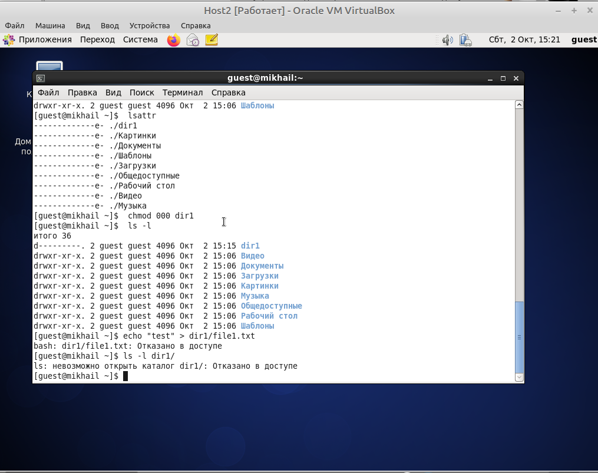

---
# Front matter
lang: ru-RU
title: "Лабораторная работа 2"
subtitle: "Права доступа"
author: "Бешкуров Михаил Борисович"

# Formatting
toc-title: "Содержание"
toc: true # Table of contents
toc_depth: 2
fontsize: 12pt
linestretch: 1.5
papersize: a4paper
documentclass: scrreprt
polyglossia-lang: russian
polyglossia-otherlangs: english
mainfont: PT Serif
romanfont: PT Serif
sansfont: PT Sans
monofont: PT Mono
mainfontoptions: Ligatures=TeX
romanfontoptions: Ligatures=TeX
sansfontoptions: Ligatures=TeX,Scale=MatchLowercase
monofontoptions: Scale=MatchLowercase
indent: true
pdf-engine: lualatex
header-includes:
  - \linepenalty=10 # the penalty added to the badness of each line within a paragraph (no associated penalty node) Increasing the value makes tex try to have fewer lines in the paragraph.
  - \interlinepenalty=0 # value of the penalty (node) added after each line of a paragraph.
  - \hyphenpenalty=50 # the penalty for line breaking at an automatically inserted hyphen
  - \exhyphenpenalty=50 # the penalty for line breaking at an explicit hyphen
  - \binoppenalty=700 # the penalty for breaking a line at a binary operator
  - \relpenalty=500 # the penalty for breaking a line at a relation
  - \clubpenalty=150 # extra penalty for breaking after first line of a paragraph
  - \widowpenalty=150 # extra penalty for breaking before last line of a paragraph
  - \displaywidowpenalty=50 # extra penalty for breaking before last line before a display math
  - \brokenpenalty=100 # extra penalty for page breaking after a hyphenated line
  - \predisplaypenalty=10000 # penalty for breaking before a display
  - \postdisplaypenalty=0 # penalty for breaking after a display
  - \floatingpenalty = 20000 # penalty for splitting an insertion (can only be split footnote in standard LaTeX)
  - \raggedbottom # or \flushbottom
  - \usepackage{float} # keep figures where there are in the text
  - \floatplacement{figure}{H} # keep figures where there are in the text
---

# Цель работы

Получение практических навыков работы в консоли с атрибутами файлов, закрепление теоретических основ дискреционного разграничения доступа в современных системах с открытым кодом на базе ОС Linux.

# Задание

1. Создать учетную запись пользователя guest.
2. Войти в терминал, используя созданную учетную запись, и выполнить ряд команд.
3. Заполнить таблицу "Установленные права и разрешенные действия"
4. Заполнить таблицу "Минимальные права для совершения операций"

# Выполнение лабораторной работы

1. В установленной при выполнении предыдущей лабораторной работы операционной системе создал учётную запись пользователя guest (использовал учётную запись администратора) (рис - @fig:001). Для этого использовал команду \texttt{user add guess}

{ #fig:001 width=70% }

Задал пароль для пользователя \texttt{guest} (использовал учётную запись администратора) (рис -@fig:002). Для этого использовал команду \texttt{passwd guest}

{ #fig:002 width=70% }

Вошел в систему от имени пользователя \texttt{guest}.

2. Определил директорию, в которой я нахожусь, командой \texttt{pwd}. Она совпадает с приглашением командной строки. Определил, что она не является моей домашней директорией. Перешл в свою домашнюю директорию. (рис -@fig:004)

{ #fig:004 width=70% }

Уточнил имя своего пользователя командой \texttt{whoami} (рис -@fig:005).

{ #fig:005 width=70% }

Уточнил имя своего пользователя, его группу, а также группы, куда входит пользователь, командой \texttt{id}. Выведенные значения \texttt{uid}, \texttt{gid} и др. запомнил. Группы совпадают, однако вывод команды \texttt{id} объемнее (рис -@fig:006).

{ #fig:006 width=70% }

Сравнил полученную информацию об имени пользователя с данными, выводимыми в приглашении командной строки. Как видно из рисунка, информация об имени пользователя, полученная командой \texttt{id} (\texttt{gid=501(guest)}), совпадает с приглашением командной строки (\texttt{guest@mikhail home})

Просмотрел файл \texttt{/etc/passwd} командой \texttt{cat /etc/passwd} (рис -@fig:008)

{ #fig:008 width=70% }

Нашел свою учетную запись (последняя строчка). Определил \texttt{uid} и \texttt{gid} пользователя (501 и 501 соответственно). Они совпадают со значениями \texttt{uid} и \texttt{gid}, полученными на предыдущих пунктах.

Для того, чтобы вывести только строки, содержащие определенные буквенные сочетания, необходимо воспользоваться программой grep в терминале (рис -@fig:010)

{ #fig:009 width=70% }

Определил существующие в системе директории командой \texttt{ls -l  /home/} (рис -@fig:011)

{ #fig:011 width=70% }

Мне удалось получить список поддиректорий директории \texttt{/home}. На поддиректориях установлены права на чтение (r), запись (w) и исполнение (x).

Проверил, какие расширенные атрибуты установлены на поддиректориях, находящихся в директории \texttt{/home} с помощью команды \texttt{lsattr /home} (рис -@fig:012)

{ #fig:012 width=70% }

Удалось увидеть расширенные атрибуты директории \texttt{guest}. Однако не удалось увидеть расширенные атрибуты других директорий (\texttt{mikhail}).

Создал в домашней директории поддиректорию \texttt{dir1} командой \texttt{mkdir dir1} (рис. -@fig:013)

{ #fig:013 width=70% }

Также с помощью команд \texttt{ls -l} и \texttt{lsattr} просмотрел, какие атрибуты выставлены на директорию \texttt{dir1} (drwxrwxr-x и -------------e- соответственно).

Снял с директории \texttt{dir1} все атрибуты командой \texttt{chmod 000 dir1} и проверил правильность выполнения команды с помощью \texttt{ls -l} (рис. -@fig:014)

{ #fig:014 width=70% }

Попытался создать в директории \texttt{dir1} файл \texttt{file1} командой \texttt{echo "test" > /home/guest/dir1/file1} (рис. -@fig:015). Я получил отказ, т.к. на предыдущим шаге для директории \texttt{dir} были сняты все атрибуты.

{ #fig:015 width=70% }

С помощью команды \texttt{ls -l /home/guest/dir1} выяснил, что невозможно получить доступ к директории \texttt{dir1}. Файл \texttt{file1} действительно не находится в директории

3. Заполнил таблицу "Установленные права и разрешенные действия", выполняя действия от имени владельца директории (файлов), определив опытным путем, какие операции разрешены, а какие нет. "+" - операция разрешена, "-" - операция не разрешена (таб. 3.1)

|Права директории|Права файла|Создание файла|Удаление файла|Запись в файл|Чтение файла|Смена директории|Просмотр файлов в директории|Переименование файла|Смена атрибутов файла|
|----------------|-----------|--------------|--------------|-------------|------------|----------------|----------------------------|--------------------|---------------------|
|d(000)          |(000)      |-             |-             |-            |-           |-               |-                           |-                   |-                    |
|d(000)          |(100)      |-             |-             |-            |-           |-               |-                           |-                   |-                    |
|d(000)          |(200)      |-             |-             |-            |-           |-               |-                           |-                   |-                    |
|d(000)          |(300)      |-             |-             |-            |-           |-               |-                           |-                   |-                    |
|d(000)          |(400)      |-             |-             |-            |-           |-               |-                           |-                   |-                    |
|d(000)          |(500)      |-             |-             |-            |-           |-               |-                           |-                   |-                    |
|d(000)          |(600)      |-             |-             |-            |-           |-               |-                           |-                   |-                    |
|d(000)          |(700)      |-             |-             |-            |-           |-               |-                           |-                   |-                    |
|d(100)          |(000)      |-             |-             |-            |-           |-               |-                           |-                   |+                    |
|d(100)          |(100)      |-             |-             |-            |-           |-               |-                           |-                   |+                    |
|d(100)          |(200)      |-             |-             |+            |-           |-               |-                           |-                   |+                    |
|d(100)          |(300)      |-             |-             |+            |-           |-               |-                           |-                   |+                    |
|d(100)          |(400)      |-             |-             |-            |+           |-               |-                           |-                   |+                    |
|d(100)          |(500)      |-             |-             |-            |+           |-               |-                           |-                   |+                    |
|d(100)          |(600)      |-             |-             |+            |+           |-               |-                           |-                   |+                    |
|d(100)          |(700)      |-             |-             |+            |+           |-               |-                           |-                   |+                    |
|d(200)          |(000)      |-             |-             |-            |-           |-               |-                           |-                   |-                    |
|d(200)          |(100)      |-             |-             |-            |-           |-               |-                           |-                   |-                    |
|d(200)          |(200)      |-             |-             |-            |-           |-               |-                           |-                   |-                    |
|d(200)          |(300)      |-             |-             |-            |-           |-               |-                           |-                   |-                    |
|d(200)          |(400)      |-             |-             |-            |-           |-               |-                           |-                   |-                    |
|d(200)          |(500)      |-             |-             |-            |-           |-               |-                           |-                   |-                    |
|d(200)          |(600)      |-             |-             |-            |-           |-               |-                           |-                   |-                    |
|d(200)          |(700)      |-             |-             |-            |-           |-               |-                           |-                   |-                    |
|d(300)          |(000)      |+             |+             |-            |-           |+               |-                           |+                   |+                    |
|d(300)          |(100)      |+             |+             |-            |-           |+               |-                           |+                   |+                    |
|d(300)          |(200)      |+             |+             |+            |-           |+               |-                           |+                   |+                    |
|d(300)          |(300)      |+             |+             |+            |-           |+               |-                           |+                   |+                    |
|d(300)          |(400)      |+             |+             |-            |+           |+               |-                           |+                   |+                    |
|d(300)          |(500)      |+             |+             |-            |+           |+               |-                           |+                   |+                    |
|d(300)          |(600)      |+             |+             |+            |+           |+               |-                           |+                   |-                    |
|d(300)          |(700)      |+             |+             |+            |+           |+               |-                           |+                   |-                    |
|d(400)          |(000)      |-             |-             |-            |-           |-               |+                           |-                   |-                    |
|d(400)          |(100)      |-             |-             |-            |-           |-               |+                           |-                   |-                    |
|d(400)          |(200)      |-             |-             |-            |-           |-               |+                           |-                   |-                    |
|d(400)          |(300)      |-             |-             |-            |-           |-               |+                           |-                   |-                    |
|d(400)          |(400)      |-             |-             |-            |-           |-               |+                           |-                   |-                    |
|d(400)          |(500)      |-             |-             |-            |-           |-               |+                           |-                   |-                    |
|d(400)          |(600)      |-             |-             |-            |-           |-               |+                           |-                   |-                    |
|d(400)          |(700)      |-             |-             |-            |-           |-               |+                           |-                   |-                    |
|d(500)          |(000)      |+             |-             |-            |-           |-               |+                           |-                   |+                    |
|d(500)          |(100)      |+             |-             |-            |-           |-               |+                           |-                   |+                    |
|d(500)          |(200)      |+             |-             |+            |-           |-               |+                           |-                   |+                    |
|d(500)          |(300)      |+             |-             |+            |-           |-               |+                           |-                   |+                    |
|d(500)          |(400)      |+             |-             |-            |+           |-               |+                           |-                   |+                    |
|d(500)          |(500)      |+             |-             |-            |+           |-               |+                           |-                   |+                    |
|d(500)          |(600)      |+             |-             |+            |+           |-               |+                           |-                   |+                    |
|d(500)          |(700)      |+             |-             |+            |+           |-               |+                           |-                   |+                    |
|d(600)          |(000)      |-             |-             |-            |-           |-               |+                           |-                   |-                    |
|d(600)          |(100)      |-             |-             |-            |-           |-               |+                           |-                   |-                    |
|d(600)          |(200)      |-             |-             |-            |-           |-               |+                           |-                   |-                    |
|d(600)          |(300)      |-             |-             |-            |-           |-               |+                           |-                   |-                    |
|d(600)          |(400)      |-             |-             |-            |-           |-               |+                           |-                   |-                    |
|d(600)          |(500)      |-             |-             |-            |-           |-               |+                           |-                   |-                    |
|d(600)          |(600)      |-             |-             |-            |-           |-               |+                           |-                   |-                    |
|d(600)          |(700)      |-             |-             |-            |-           |-               |+                           |-                   |-                    |
|d(700)          |(000)      |+             |+             |-            |-           |+               |+                           |+                   |+                    |
|d(700)          |(100)      |+             |+             |-            |-           |+               |+                           |+                   |+                    |
|d(700)          |(200)      |+             |+             |+            |-           |+               |+                           |+                   |+                    |
|d(700)          |(300)      |+             |+             |+            |-           |+               |+                           |+                   |+                    |
|d(700)          |(400)      |+             |+             |-            |+           |+               |+                           |+                   |+                    |
|d(700)          |(500)      |+             |+             |-            |+           |+               |+                           |+                   |+                    |
|d(700)          |(600)      |+             |+             |+            |+           |+               |+                           |+                   |+                    |
|d(700)          |(700)      |+             |+             |+            |+           |+               |+                           |+                   |+                    |

: Установленные права и разрешённые действия

4. На основании заполненной выше таблицы определил те или иные минимально необходимые права для выполнения операций внутри директории \texttt{dir1}, заполняя таблицу "Установленные права и разрешенные действия" (таб. 3.2).

|Операция              |min права на директорию|min права на файл|
|----------------------|-----------------------|-----------------|
|Создание файла        |(-wx)(3)               |(- - -)(0)       |
|Удаление файла        |(-wx)(3)               |(- - -)(0)       |
|Чтение файла          |(- - x)(1)             |(r - -)(4)       |
|Запись в файл         |(- - x)(1)             |(-w-)(2)         |
|Переименование файла  |(-wx)(3)               |(- - -)(0)       |
|Создание поддиректории|(-wx)(3)               |(- - -)(0)       |
|Удаление поддиректории|(-wx)(3)               |(- - -)(0)       |

: Минимальные права для совершения операций

# Выводы

Получил практическик навыки работы в консоли с атрибутами файлов, закрепил теоретические основы дискреционного разграничения доступа в современных системах с открытым кодом на базе ОС Linux.

# Список литературы

1. Кулябов Д. С., Королькова А. В., Геворкян М. Н. Информационная безопасность компьютерных сетей. Лабораторная работа № 2. Дискреционное разграничение прав 
в Linux. Основные атрибуты
