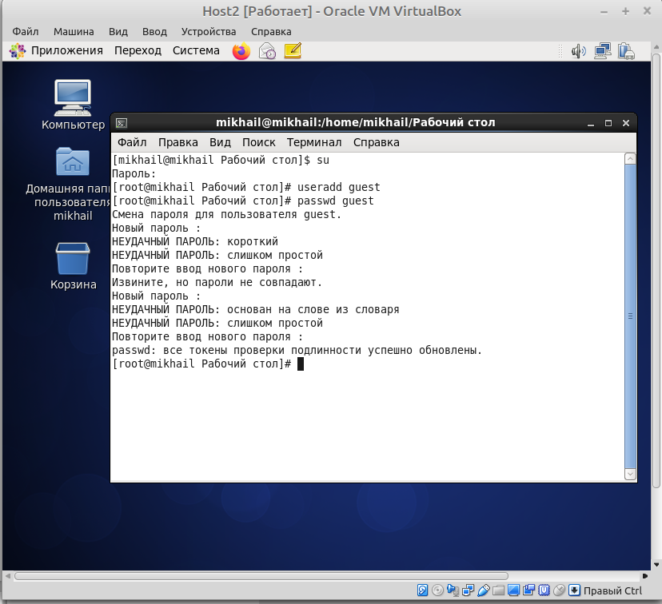
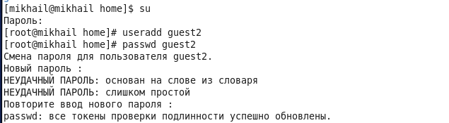
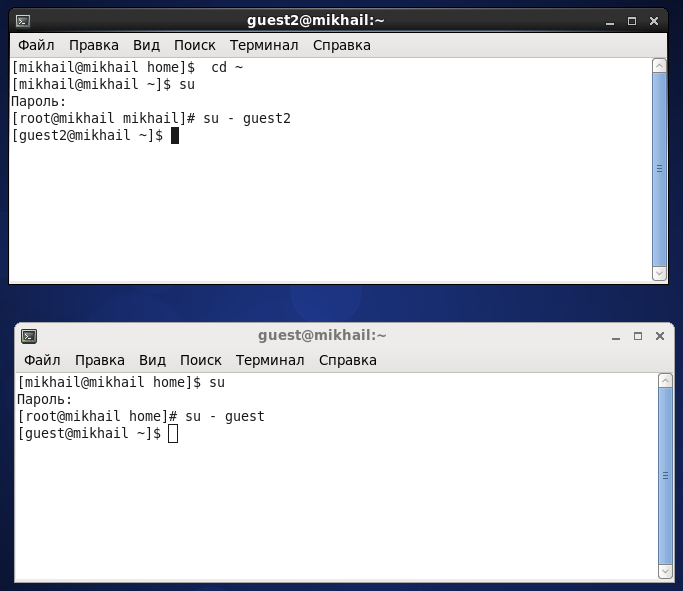
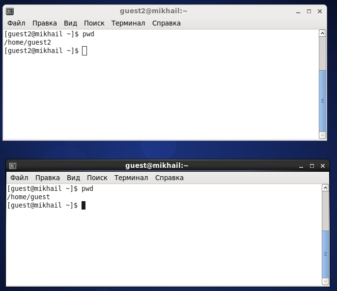
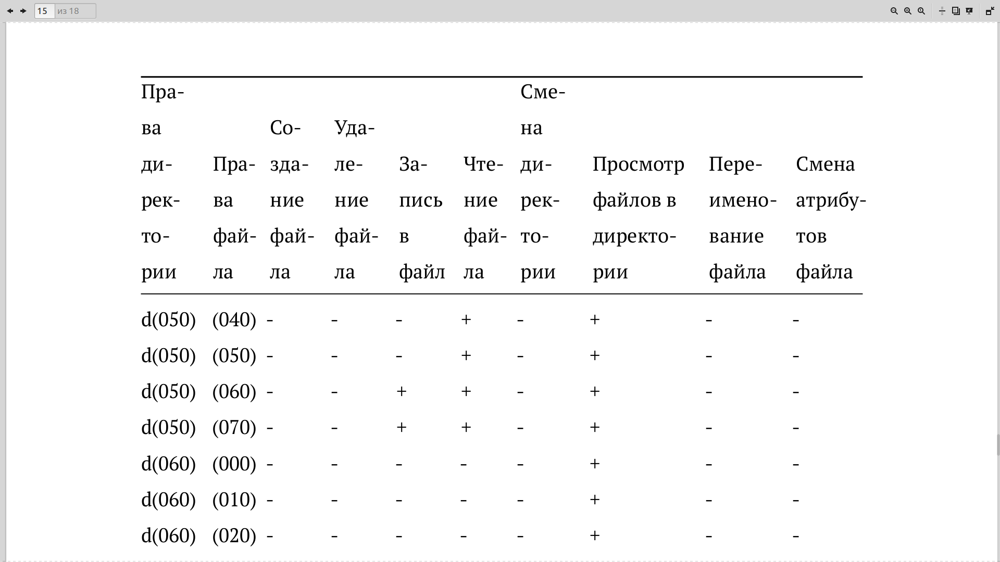
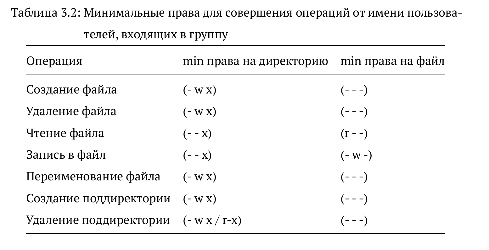

---
## Front matter
lang: ru-RU
title: Лабораторная работа №3
author: |
	Бешкуров Михаил - студент группы НКНбд-01-18
date: 15.09.2021

## Formatting
toc: false
slide_level: 2
theme: metropolis
header-includes: 
 - \metroset{progressbar=frametitle,sectionpage=progressbar,numbering=fraction}
 - '\makeatletter'
 - '\beamer@ignorenonframefalse'
 - '\makeatother'
aspectratio: 43
section-titles: true
---

# Дискреционное разграничение прав в Linux. Два пользователя

## Прагматика выполнения

- Разграничение прав доступа позволяет обычным пользователям выполнять программы от имени суперпользователя без знания его пароля.

## Цель выполнения лабораторной работы

- Получение практических навыков работы в консоли с атрибутами файлов для групп пользователей.

## Задачи выолнения работы

- Создать учетные записи guest и guest2.
- Войти от имени двух пользователей в две разные консоли и выполнить ряд команд.
- Заполнить таблицу "Установленные права и разрешенные действия для групп"
- Заполнить таблицу "Минимальные права для совершения операций от имени пользователей, входящих в группу"

## Результаты выполнения лабораторной работы

- В установленной операционной системе создал учётную запись пользователя \texttt{guest} (использовал учётную запись администратора) (рис - @fig:001).

{ #fig:001 width=70% }

##

- Аналогично создал второго пользователя \texttt{guest2} (рис -@fig:002).

{ #fig:002 width=70% }

##

- Вошел в систему от двух пользователей на двух разных консолях (рис -@fig:003).

{ #fig:003 width=70% }

##

- Для обоих пользователей командой \texttt{pwd} определил директории, в которых я нахожусь (рис -@fig:004).

{ #fig:004 width=70% }

##

- Была заполнена таблица "Установленные права и разрешенные действия для групп" (рис -@fig:005)

{ #fig:005 width=70% }

##

- Была заполнена таблица "Минимальные права для совершения операций от имени пользователей, входящих в группу" (рис -@fig:006)

{ #fig:006 width=70% }

##

Таким образом, получил практические навыки работы в консоли с атрибутами файлов для групп пользователей.
