---
# Front matter
lang: ru-RU
title: "Лабораторная работа 3"
subtitle: "Дискреционное разграничение прав в Linux. Два пользователя"
author: "Бешкуров Михаил Борисович"

# Formatting
toc-title: "Содержание"
toc: true # Table of contents
toc_depth: 2
fontsize: 12pt
linestretch: 1.5
papersize: a4paper
documentclass: scrreprt
polyglossia-lang: russian
polyglossia-otherlangs: english
mainfont: PT Serif
romanfont: PT Serif
sansfont: PT Sans
monofont: PT Mono
mainfontoptions: Ligatures=TeX
romanfontoptions: Ligatures=TeX
sansfontoptions: Ligatures=TeX,Scale=MatchLowercase
monofontoptions: Scale=MatchLowercase
indent: true
pdf-engine: lualatex
header-includes:
  - \linepenalty=10 # the penalty added to the badness of each line within a paragraph (no associated penalty node) Increasing the value makes tex try to have fewer lines in the paragraph.
  - \interlinepenalty=0 # value of the penalty (node) added after each line of a paragraph.
  - \hyphenpenalty=50 # the penalty for line breaking at an automatically inserted hyphen
  - \exhyphenpenalty=50 # the penalty for line breaking at an explicit hyphen
  - \binoppenalty=700 # the penalty for breaking a line at a binary operator
  - \relpenalty=500 # the penalty for breaking a line at a relation
  - \clubpenalty=150 # extra penalty for breaking after first line of a paragraph
  - \widowpenalty=150 # extra penalty for breaking before last line of a paragraph
  - \displaywidowpenalty=50 # extra penalty for breaking before last line before a display math
  - \brokenpenalty=100 # extra penalty for page breaking after a hyphenated line
  - \predisplaypenalty=10000 # penalty for breaking before a display
  - \postdisplaypenalty=0 # penalty for breaking after a display
  - \floatingpenalty = 20000 # penalty for splitting an insertion (can only be split footnote in standard LaTeX)
  - \raggedbottom # or \flushbottom
  - \usepackage{float} # keep figures where there are in the text
  - \floatplacement{figure}{H} # keep figures where there are in the text
---

# Цель работы

Получение практических навыков работы в консоли с атрибутами файлов для групп пользователей.

# Задание

1. Создать учетные записи guest и guest2.
2. Войти от имени двух пользователей в две разные консоли и выполнить ряд команд.
3. Заполнить таблицу "Установленные права и разрешенные действия для групп"
4. Заполнить таблицу "Минимальные права для совершения операций от имени пользователей, входящих в группу"

# Выполнение лабораторной работы

1. В установленной операционной системе создал учётную запись пользователя \texttt{guest} (использовал учётную запись администратора) (рис - @fig:001). Для этого использовал команду \texttt{user add guest}

Задал пароль для пользователя \texttt{guest} (использовал учётную запись администратора) (рис -@fig:002). Для этого использовал команду \texttt{passwd guest}

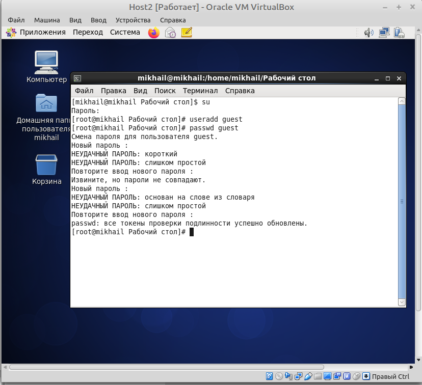{ #fig:002 width=70% }

Аналогично создал второго пользователя \texttt{guest2} (рис -@fig:003).

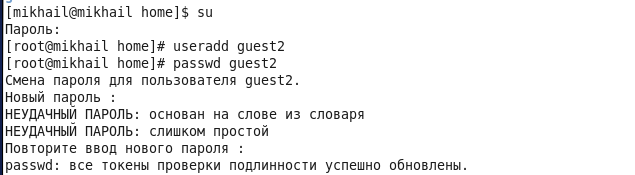{ #fig:003 width=70% }

Добавил пользователя \texttt{guest2} в группу \texttt{guest} (рис -@fig:004):

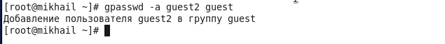{ #fig:004 width=70% }

2. Вошел в систему от двух пользователей на двух разных консолях (рис -@fig:005).

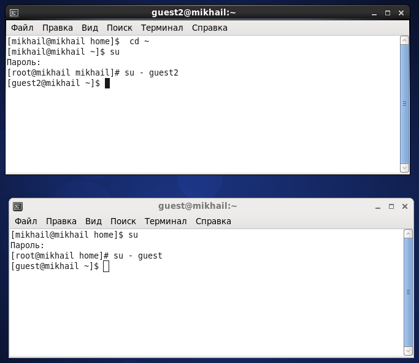{ #fig:005 width=70% }

Для обоих пользователей командой \texttt{pwd} определил директории, в которых я нахожусь. Они совпадают с приглашением командной строки (рис -@fig:006).

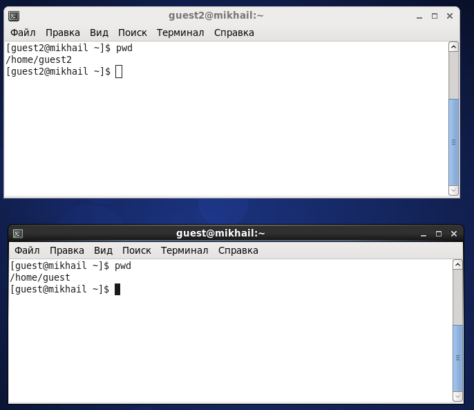{ #fig:006 width=70% }

Уточнил имена своих пользователей командой \texttt{whoami} (рис -@fig:007), их группы, кто входит в них и к каким группам принадлежат они сами, а также определил командами \texttt{groups guest} и \texttt{groups guest2}, в какие группы входят пользователи \texttt{guest} и \texttt{guest2} (рис -@fig:008).

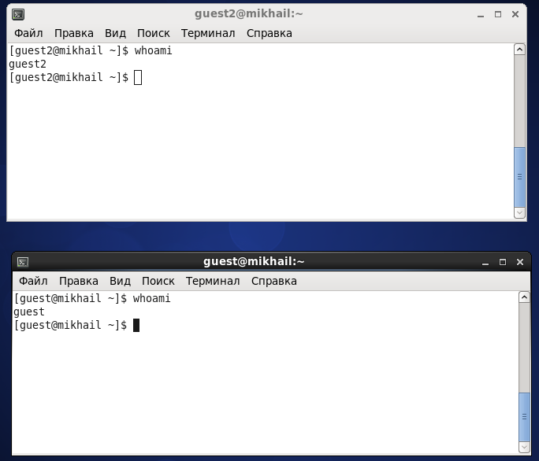{ #fig:007 width=70% }

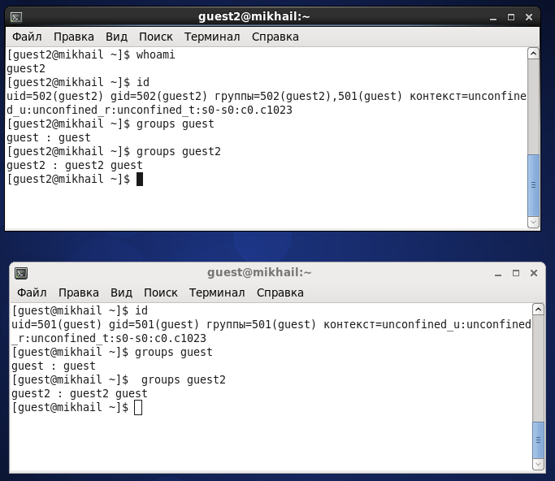{ #fig:008 width=70% }

Сравнил вывод команды \texttt{groups} с выводом команд \texttt{id -Gn} и \texttt{id -G} (рис -@fig:009). Группы совпадают, однако при выводкоманд \texttt{id -Gn} и \texttt{id -G} объемнее.

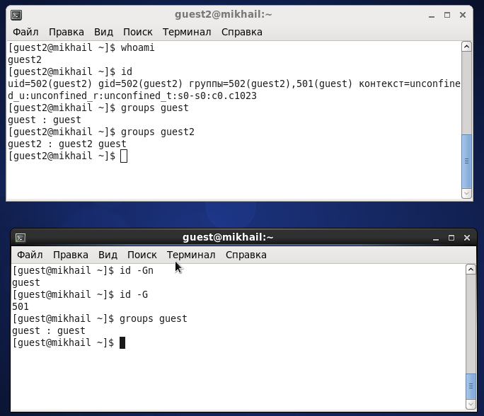{ #fig:009 width=70% }

Сравнил полученную информацию с содержимым файла \texttt{/etc/group}. Просмотрел файл командой \texttt{cat /etc/group} (рис -@fig:010, рис -@fig:011)

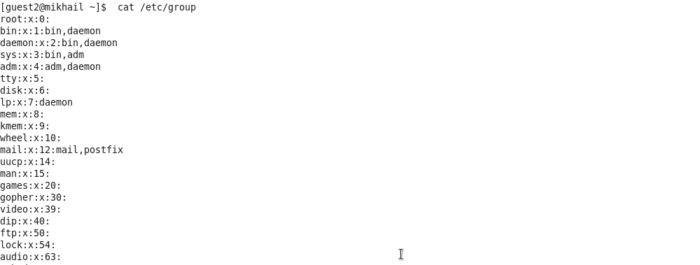{ #fig:010 width=70% }

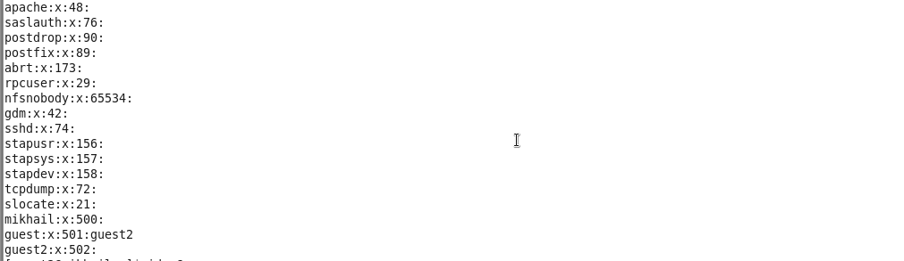{ #fig:011 width=70% }

Как видно из рисунка, информация об имени пользователя совпадает с полученной ранее информацией.

От имени пользователя \texttt{guest2} выполнил регистрацию пользователя \texttt{guest2} в группе \texttt{guest} командой \texttt{newgrp guest} (рис -@fig:012)

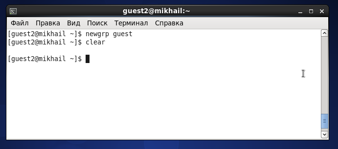{ #fig:012 width=70% }

От имени пользователя \texttt{guest} изменил права директории \texttt{/home/guest}, разрешив все действия для пользователей группы, командой \texttt{chmod g+rwx /home/guest} (рис -@fig:013)

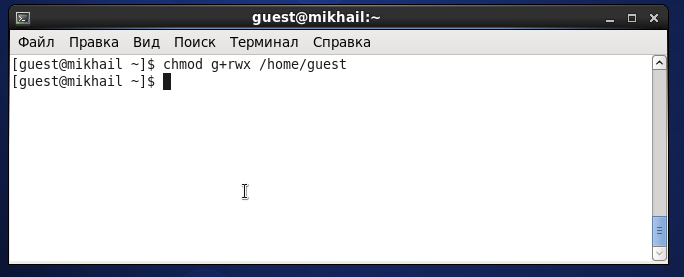{ #fig:013 width=70% }

От имени пользователя \texttt{guest} снял с директории \texttt{/home/guest/dir1} все атрибуты командой \texttt{chmod 000 dir1}. Проверил это действие с помощью команды \texttt{ls -l} (рис -@fig:014)

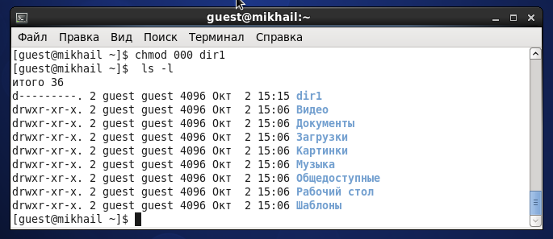{ #fig:014 width=70% }

3. Заполнил таблицу "Установленные права и разрешенные действия для групп", меняя атрибуты у директории \texttt{dir1} и файла \texttt{file1} от имени пользователя \texttt{guest}, делая проверку от пользователя \texttt{guest2} и определяя опытным путем, какие операции разрешены, а какие нет. "+" - операция разрешена, "-" - операция не разрешена (таб. 3.1)

|Права директории|Права файла|Создание файла|Удаление файла|Запись в файл|Чтение файла|Смена директории|Просмотр файлов в директории|Переименование файла|Смена атрибутов файла|
|----------------|-----------|--------------|--------------|-------------|------------|----------------|----------------------------|--------------------|---------------------|
|d(000)          |(000)      |-             |-             |-            |-           |-               |-                           |-                   |-                    |
|d(000)          |(010)      |-             |-             |-            |-           |-               |-                           |-                   |-                    |
|d(000)          |(020)      |-             |-             |-            |-           |-               |-                           |-                   |-                    |
|d(000)          |(030)      |-             |-             |-            |-           |-               |-                           |-                   |-                    |
|d(000)          |(040)      |-             |-             |-            |-           |-               |-                           |-                   |-                    |
|d(000)          |(050)      |-             |-             |-            |-           |-               |-                           |-                   |-                    |
|d(000)          |(060)      |-             |-             |-            |-           |-               |-                           |-                   |-                    |
|d(000)          |(070)      |-             |-             |-            |-           |-               |-                           |-                   |-                    |
|d(010)          |(000)      |-             |-             |-            |-           |-               |-                           |-                   |-                    |
|d(010)          |(010)      |-             |-             |-            |-           |-               |-                           |-                   |-                    |
|d(010)          |(020)      |-             |-             |+            |-           |-               |-                           |-                   |-                    |
|d(010)          |(030)      |-             |-             |+            |-           |-               |-                           |-                   |-                    |
|d(010)          |(040)      |-             |-             |-            |+           |-               |-                           |-                   |-                    |
|d(010)          |(050)      |-             |-             |-            |+           |-               |-                           |-                   |-                    |
|d(010)          |(060)      |-             |-             |+            |+           |-               |-                           |-                   |-                    |
|d(100)          |(070)      |-             |-             |+            |+           |-               |-                           |-                   |-                    |
|d(020)          |(000)      |-             |-             |-            |-           |-               |-                           |-                   |-                    |
|d(020)          |(010)      |-             |-             |-            |-           |-               |-                           |-                   |-                    |
|d(020)          |(020)      |-             |-             |-            |-           |-               |-                           |-                   |-                    |
|d(020)          |(030)      |-             |-             |-            |-           |-               |-                           |-                   |-                    |
|d(020)          |(040)      |-             |-             |-            |-           |-               |-                           |-                   |-                    |
|d(020)          |(050)      |-             |-             |-            |-           |-               |-                           |-                   |-                    |
|d(020)          |(060)      |-             |-             |-            |-           |-               |-                           |-                   |-                    |
|d(020)          |(070)      |-             |-             |-            |-           |-               |-                           |-                   |-                    |
|d(030)          |(000)      |+             |+             |-            |-           |+               |-                           |+                   |+                    |
|d(030)          |(010)      |+             |+             |-            |-           |+               |-                           |+                   |+                    |
|d(030)          |(020)      |+             |+             |-            |-           |+               |-                           |+                   |+                    |
|d(030)          |(030)      |+             |+             |-            |-           |+               |-                           |+                   |+                    |
|d(030)          |(040)      |+             |+             |-            |-           |+               |-                           |+                   |+                    |
|d(030)          |(050)      |+             |+             |-            |-           |+               |-                           |+                   |+                    |
|d(030)          |(060)      |+             |+             |-            |-           |+               |-                           |+                   |+                    |
|d(030)          |(070)      |+             |+             |-            |-           |+               |-                           |+                   |+                    |
|d(040)          |(000)      |-             |-             |-            |-           |-               |+                           |-                   |-                    |
|d(040)          |(010)      |-             |-             |-            |-           |-               |+                           |-                   |-                    |
|d(040)          |(020)      |-             |-             |-            |-           |-               |+                           |-                   |-                    |
|d(040)          |(030)      |-             |-             |-            |-           |-               |+                           |-                   |-                    |
|d(040)          |(040)      |-             |-             |-            |-           |-               |+                           |-                   |-                    |
|d(040)          |(050)      |-             |-             |-            |-           |-               |+                           |-                   |-                    |
|d(040)          |(060)      |-             |-             |-            |-           |-               |+                           |-                   |-                    |
|d(040)          |(070)      |-             |-             |-            |-           |-               |+                           |-                   |-                    |
|d(050)          |(000)      |-             |-             |-            |-           |-               |+                           |-                   |-                    |
|d(050)          |(010)      |-             |-             |-            |-           |-               |+                           |-                   |-                    |
|d(050)          |(020)      |-             |-             |+            |-           |-               |+                           |-                   |-                    |
|d(050)          |(030)      |-             |-             |+            |-           |-               |+                           |-                   |-                    |
|d(050)          |(040)      |-             |-             |-            |+           |-               |+                           |-                   |-                    |
|d(050)          |(050)      |-             |-             |-            |+           |-               |+                           |-                   |-                    |
|d(050)          |(060)      |-             |-             |+            |+           |-               |+                           |-                   |-                    |
|d(050)          |(070)      |-             |-             |+            |+           |-               |+                           |-                   |-                    |
|d(060)          |(000)      |-             |-             |-            |-           |-               |+                           |-                   |-                    |
|d(060)          |(010)      |-             |-             |-            |-           |-               |+                           |-                   |-                    |
|d(060)          |(020)      |-             |-             |-            |-           |-               |+                           |-                   |-                    |
|d(060)          |(030)      |-             |-             |-            |-           |-               |+                           |-                   |-                    |
|d(060)          |(040)      |-             |-             |-            |-           |-               |+                           |-                   |-                    |
|d(060)          |(050)      |-             |-             |-            |-           |-               |+                           |-                   |-                    |
|d(060)          |(060)      |-             |-             |-            |-           |-               |+                           |-                   |-                    |
|d(060)          |(070)      |-             |-             |-            |-           |-               |+                           |-                   |-                    |
|d(070)          |(000)      |+             |+             |-            |-           |+               |+                           |+                   |+                    |
|d(070)          |(010)      |+             |+             |-            |-           |+               |+                           |+                   |+                    |
|d(070)          |(020)      |+             |+             |-            |-           |+               |+                           |+                   |+                    |
|d(070)          |(030)      |+             |+             |-            |-           |+               |+                           |+                   |+                    |
|d(070)          |(040)      |+             |+             |-            |-           |+               |+                           |+                   |+                    |
|d(070)          |(050)      |+             |+             |-            |-           |+               |+                           |+                   |+                    |
|d(070)          |(060)      |+             |+             |-            |-           |+               |+                           |+                   |+                    |
|d(070)          |(070)      |+             |+             |-            |-           |+               |+                           |+                   |+                    |

: Установленные права и разрешенные действия для групп

4. На основании заполненной выше таблицы определил те или иные минимально необходимые права для выполнения операций внутри директории \texttt{dir1}, заполняя таблицу "Минимальные права для совершения операций от имени пользователей, входящих в группу" (таб. 3.2).

|Операция              |min права на директорию|min права на файл|
|----------------------|-----------------------|-----------------|
|Создание файла        |(- w x)                |(- - -)          |
|Удаление файла        |(- w x)                |(- - -)          |
|Чтение файла          |(- - x)                |(r - -)          |
|Запись в файл         |(- - x)                |(- w -)          |
|Переименование файла  |(- w x)                |(- - -)          |
|Создание поддиректории|(- w x)                |(- - -)          |
|Удаление поддиректории|(- w x / r-x)          |(- - -)          |

: Минимальные права для совершения операций от имени пользователей, входящих в группу

По сравнению с таблицей из предыдущей лабораторной работой, в которой рассматривались права доступа владельца, таблица 3.2 не везде имеет права на запись, чтени и изменение атрибутов файлов. Это объясняется тем, что в данной работе рассматривались права доступа для группы, к которой принадлежат владельцы.

# Выводы

Получил практические навыки работы в консоли с атрибутами файлов для групп пользователей.

# Список литературы

1. Кулябов Д. С., Королькова А. В., Геворкян М. Н. Информационная безопасность компьютерных сетей. Лабораторная работа № 3. Дискреционное разграничение прав
в Linux. Два пользователя
