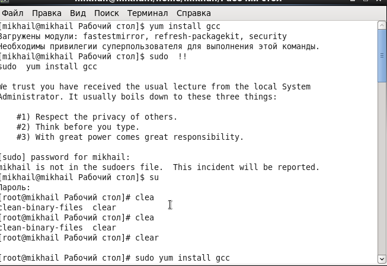
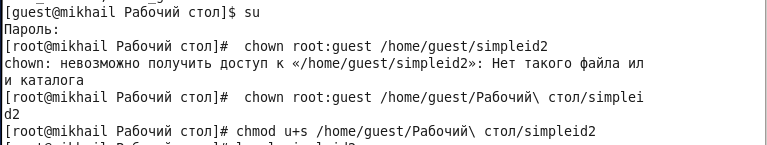
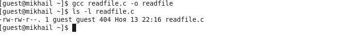
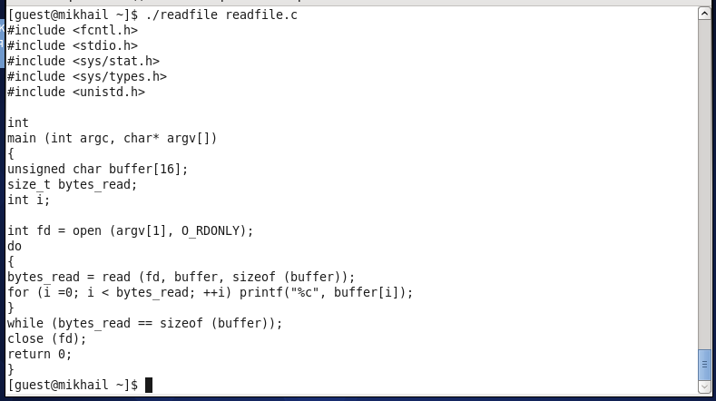
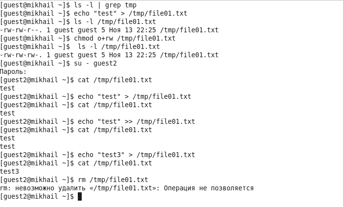
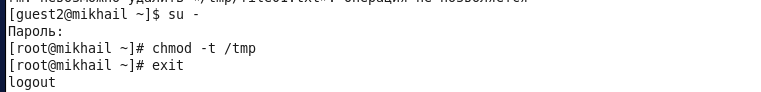
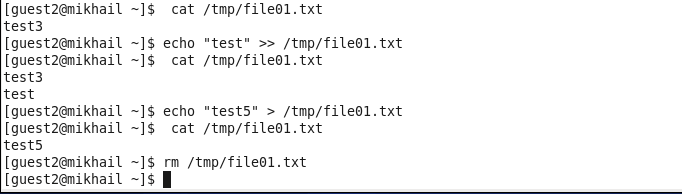

---
## Front matter
lang: ru-RU
title: Лабораторная работа №5
author: |
	Бешкуров Михаил
date: 13.11.2021

## Formatting
toc: false
slide_level: 2
theme: metropolis
header-includes: 
 - \metroset{progressbar=frametitle,sectionpage=progressbar,numbering=fraction}
 - '\makeatletter'
 - '\beamer@ignorenonframefalse'
 - '\makeatother'
aspectratio: 43
section-titles: true
---

# Дискреционное разграничение прав в Linux. Исследование влияния дополнительных атрибутов

## Прагматика выполнения

- Помимо прав администратора в некоторых случаях требуются средства разработки приложений. Для разграничения их прав нужно использовать дополнительные атрибуты.

## Цель выполнения лабораторной работы

- Изучение механизмов изменения идентификаторов, применения SetUID- и Sticky-битов. Получение практических навыков работы в консоли с дополнительными атрибутами. Рассмотрение работы механизма смены идентификатора процессов пользователей, а также влияние бита Sticky на запись и удаление файлов.

## Задачи выолнения работы

- Подготовить лабораторный стенд
- Рассмотреть компиляцию программ
- Создать программы
- Исследовать Sticky-бит

## Результаты выполнения лабораторной работы

- Подготовил лабораторный стенд (рис - @fig:001).

{ #fig:001 width=70% }

##

- Провел работу с программами (рис -@fig:003, рис -@fig:004, рис -@fig:005).

{ #fig:003 width=70% }

##

{ #fig:004 width=70% }

##

{ #fig:005 width=70% }

##

- Исследовал Sticky-бит (рис -@fig:006, рис -@fig:007, рис -@fig:008).

{ #fig:007 width=70% }

##

{ #fig:071 width=70% }

##

{ #fig:008 width=70% }

##

Таким образом, я изучил механизмы изменения идентификаторов, применения SetUID- и Sticky-битов. Получил практические навыки работы в консоли с дополнительными атрибутами. Рассмотрел работу механизма смены идентификатора процессов пользователей, а также влияние бита Sticky на запись и удаление файлов.
