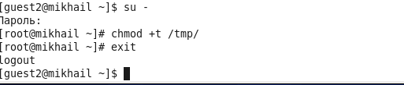

---
# Front matter
lang: ru-RU
title: "Лабораторная работа 5"
subtitle: "Дискреционное разграничение прав в Linux. Дискреционное разграничение прав в Linux. Исследование влияния дополнительных атрибутов"
author: "Бешкуров Михаил Борисович"

# Formatting
toc-title: "Содержание"
toc: true # Table of contents
toc_depth: 2
fontsize: 12pt
linestretch: 1.5
papersize: a4paper
documentclass: scrreprt
polyglossia-lang: russian
polyglossia-otherlangs: english
mainfont: PT Serif
romanfont: PT Serif
sansfont: PT Sans
monofont: PT Mono
mainfontoptions: Ligatures=TeX
romanfontoptions: Ligatures=TeX
sansfontoptions: Ligatures=TeX,Scale=MatchLowercase
monofontoptions: Scale=MatchLowercase
indent: true
pdf-engine: lualatex
header-includes:
  - \linepenalty=10 # the penalty added to the badness of each line within a paragraph (no associated penalty node) Increasing the value makes tex try to have fewer lines in the paragraph.
  - \interlinepenalty=0 # value of the penalty (node) added after each line of a paragraph.
  - \hyphenpenalty=50 # the penalty for line breaking at an automatically inserted hyphen
  - \exhyphenpenalty=50 # the penalty for line breaking at an explicit hyphen
  - \binoppenalty=700 # the penalty for breaking a line at a binary operator
  - \relpenalty=500 # the penalty for breaking a line at a relation
  - \clubpenalty=150 # extra penalty for breaking after first line of a paragraph
  - \widowpenalty=150 # extra penalty for breaking before last line of a paragraph
  - \displaywidowpenalty=50 # extra penalty for breaking before last line before a display math
  - \brokenpenalty=100 # extra penalty for page breaking after a hyphenated line
  - \predisplaypenalty=10000 # penalty for breaking before a display
  - \postdisplaypenalty=0 # penalty for breaking after a display
  - \floatingpenalty = 20000 # penalty for splitting an insertion (can only be split footnote in standard LaTeX)
  - \raggedbottom # or \flushbottom
  - \usepackage{float} # keep figures where there are in the text
  - \floatplacement{figure}{H} # keep figures where there are in the text
---

# Цель работы

Изучение механизмов изменения идентификаторов, применения SetUID- и Sticky-битов. Получение практических навыков работы в консоли с дополнительными атрибутами. Рассмотрение работы механизма смены идентификатора процессов пользователей, а также влияние бита Sticky на запись и удаление файлов. [1]

# Задание

1. Подготовить лабораторный стенд
2. Рассмотреть компиляцию программ
3. Создать программы
4. Исследовать Sticky-бит

# Выполнение лабораторной работы

1. Предварительно установил компилятор gcc с помощью команды \texttt{yum install gcc} (рис - @fig:001).

{ #fig:001 width=70% }

Отключил систему защиты SELinux с помощью команды \texttt{setenforce 0}. После этого команда \texttt{getenforce} вывела \texttt{Permissive}.

2. Изучил компиляцию программ. Компилятор языка С называется gcc. Компилятор языка С++ называется g++ и запускается с параметрами почти так же, как gcc. Проверил это с поомщью команд \texttt{whereis gcc} и \texttt{whereis g++}.

3. Вошел в в систему от имени пользователя \texttt{guest} и создал программу \texttt{simpleid.c}.(рис - @fig:002)

{ #fig:002 width=70% }

Скомпилировал программу и убедился, что файл программы создан с помощью команды \texttt{gcc simpleid.c -o simpleid} (рис -@fig:003)

{ #fig:003 width=70% }

Выполнил программу \texttt{simpleid} (рис -@fig:004)

{ #fig:004 width=70% }

Выполнил системную программу \texttt{id} (рис -@fig:005)

{ #fig:005 width=70% }

Вывод обоих способ совпадает. 

Усложнил программу, добавив вывод действительных идентификаторов

Получившуюся программу назвал \texttt{simpleid2.c}

Скомпилировал и запустил \texttt{simpleid2.c} (рис -@fig:006)

{ #fig:006 width=70% }

От имени суперпользователя выполнил следующие команды (рис -@fig:007)

{ #fig:007 width=70% }

Команда \texttt{su} используется для получения прав суперпользователя. 

Выполнил проверку правильности установки новых атрибутов и смены владельца файла \texttt{simpleid2} (рис -@fig:008)

Запустил \texttt{simpleid2} и \texttt{id} (рис -@fig:008)

{ #fig:008 width=70% }

Проделал тоже самое относительно SetGID-бита 

Создал программу \texttt{readfile.c}

Откомпилировал созданную программу (рис -@fig:009)

{ #fig:009 width=70% }

Сменил владельца у файла \texttt{readfile.c} и изменил права так, чтобы только суперпользователь мог прочитать его, а \texttt{guest} не мог

Проверил, что пользователь \texttt{guest} не может прочитать файл \texttt{readfile.c} 

{ #fig:021 width=70% }

Сменил у программы \texttt{readfile} владельца и утсановил SetUID-бит 

Проверил, может ли программа \texttt{readfile} прочитать файл \texttt{readfile.c}. Да, может. 

{ #fig:023 width=70% }

Проверил, может ли программа \texttt{readfile} прочитать файл \texttt{/etc/shadow}. Да, может. 

{ #fig:025 width=70% }

4. Исследовал Sticky-бит 
Выяснил, что атрибут Sticky установлен на директорию \texttt{/tmp}, для чего выполнил команду \texttt{ls -l / | grep tmp} 

От имени пользователя \texttt{guest} создал файл \texttt{file01.txt} в директории \texttt{/tmp} со словом \texttt{test}:

Просмотрел атрибуты у только что созданного файла и разрешил чтение и запись для категории пользователей "все остальные":

{ #fig:028 width=70% }

От имени пользователя \texttt{guest2} (не являющегося владельцем) прочитал файл \texttt{/tmp/file01.txt}:

От имени пользователя \texttt{guest2} дозаписал в файл \texttt{/tmp/file01.txt} слово \texttt{test2}:

Проверил содержимое файла:

От имени пользователя \texttt{guest2} записал в файл \texttt{/tmp/file01.txt} слово \texttt{test3}, стерев при этом всю имеющуюся в файле информацию:

Проверил содержимое файла:

От имени пользователя \texttt{guest2} попробовал удалить файл \texttt{/tmp/file01.txt} :

Мне не удалось удалить файл. 

{ #fig:034 width=70% }

Повысил свои права до суперпользователя и выполнил после этого команду, снимающую атрибут \texttt{t} (Sticky-бит) с директории \texttt{/tmp}(рис -@fig:035):

{ #fig:035 width=70% }

Покинул режим суперпользователя командой \texttt{exit}:

Повторил предыдущие шаги:

 

Как видно из рисунка, удалось выполнить все команды, которые были рассмотрены выше, включая удаление. 

Повысил свои права до суперпользователя и вернул атрибут \texttt{t} на директорию \texttt{/tmp}:

# Выводы

Изучил механизмы изменения идентификаторов, применения SetUID- и Sticky-битов. Получил практические навыки работы в консоли с дополнительными атрибутами. Рассмотрел работу механизма смены идентификатора процессов пользователей, а также влияние бита Sticky на запись и удаление файлов.

# Список литературы

1. Кулябов Д. С., Королькова А. В., Геворкян М. Н. Информационная безопасность компьютерных сетей. Лабораторная работа № 5. Дискреционное разграничение прав в Linux. Исследование влияния дополнительных атрибутов
