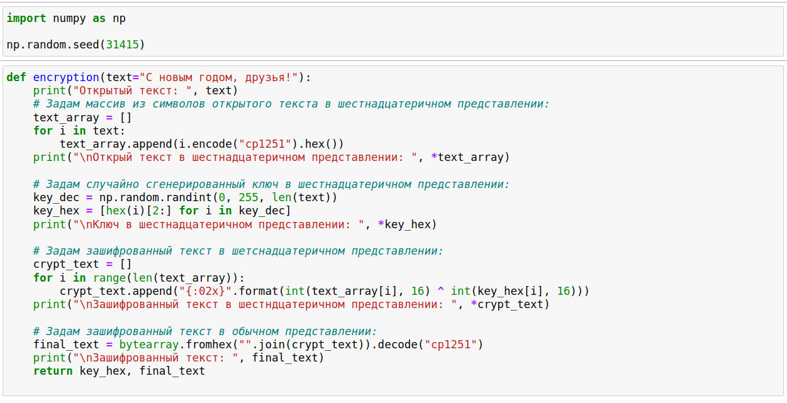
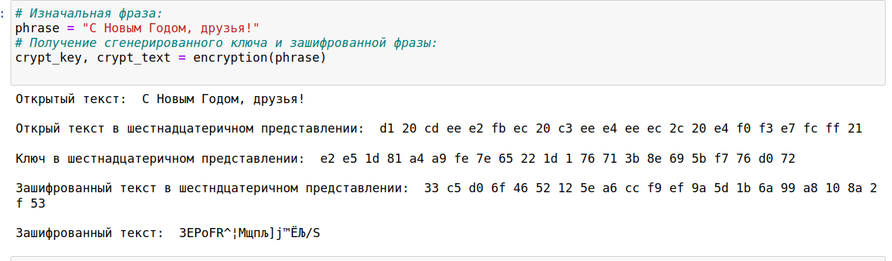
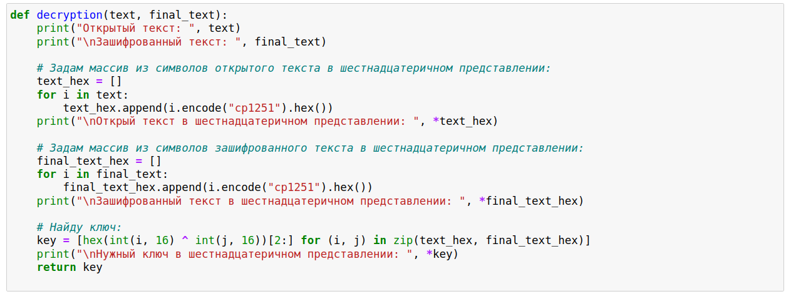
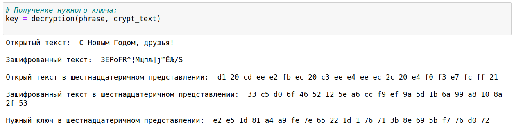
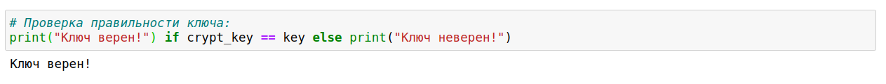

---
## Front matter
lang: ru-RU
title: Лабораторная работа №7
author: |
	Бешкуров Михаил
date: 11.12.2021

## Formatting
toc: false
slide_level: 2
theme: metropolis
header-includes: 
 - \metroset{progressbar=frametitle,sectionpage=progressbar,numbering=fraction}
 - '\makeatletter'
 - '\beamer@ignorenonframefalse'
 - '\makeatother'
aspectratio: 43
section-titles: true
---

# Элементы криптографии. Однократное гаммирование

## Прагматика выполнения

- Криптография - наука о методах шифрования. Знание однократного гаммирования и его особенностей является необходимым для дальнейшего знакомства с криптографией. 

## Цель выполнения лабораторной работы

- Освоить на практике применение режима однократного гаммирования

## Задачи выолнения работы

- Написать программу, которая должна определить вид шифротекста при известном ключе и известном открытом тексте
- Также эта программа должна определить ключ, с помощью которого шифротекст может быть преобразован в некоторый фрагмент текста, представляющий собой один из возможных вариантов прочтения открытого текста

## Результаты выполнения лабораторной работы

- Написал программу, которая определяет вид шифротекста при известном ключе и известном открытом тексте (рис - @fig:001, рис - @fig:002)

{ #fig:001 width=70% }

##

{ #fig:002 width=70% }

##

- Написанная мною программа определяет ключ, с помощью которого шифротекст может быть преобразован в некоторый фрагмент текста, представляющий собой один из возможных вариантов прочтения открытого текста (рис - @fig:003, рис - @fig:004)

{ #fig:003 width=70% }

##

{ #fig:004 width=70% }

##

{ #fig:005 width=70% }

##

Таким образом, я освоил на практике применение режима однократного гаммирования.
