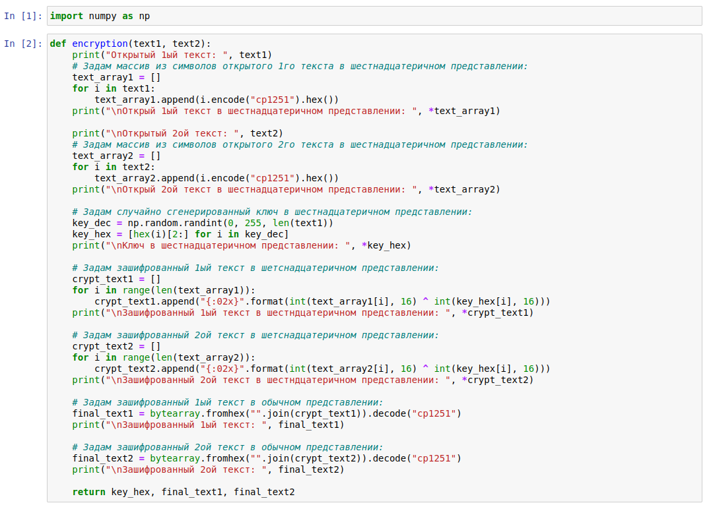
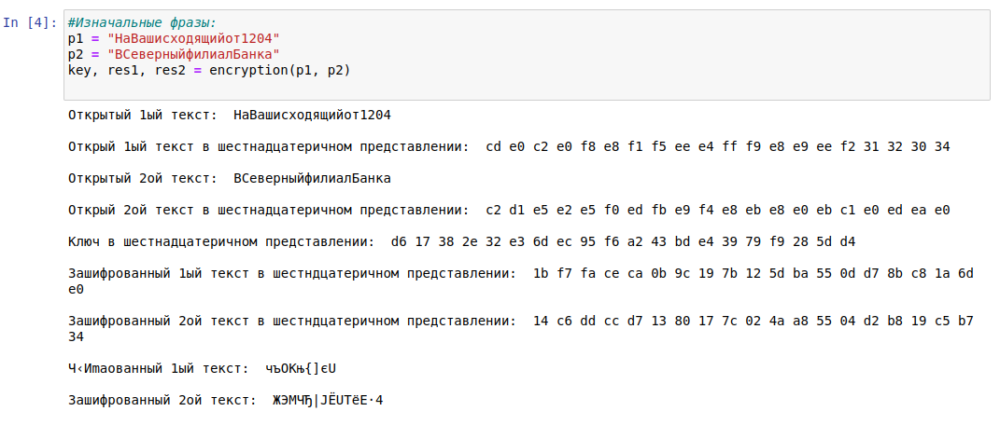
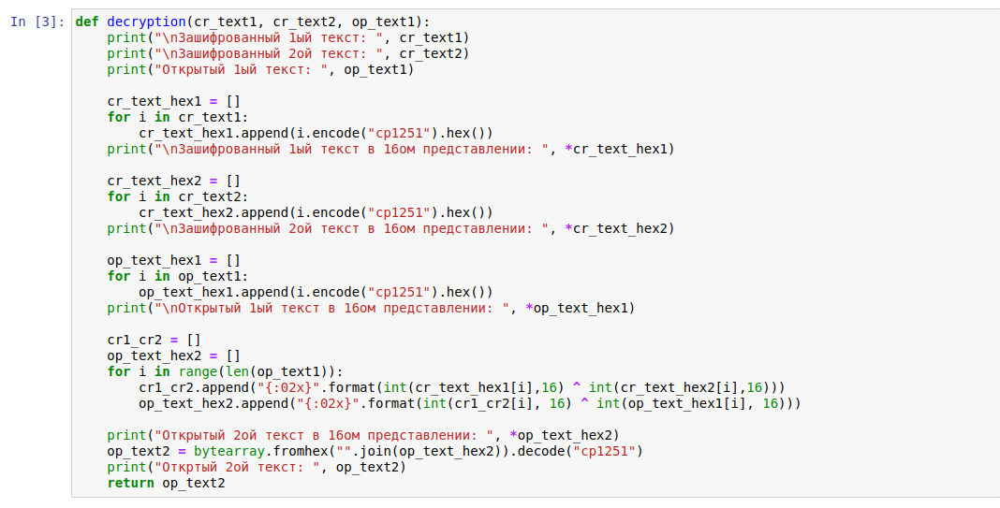
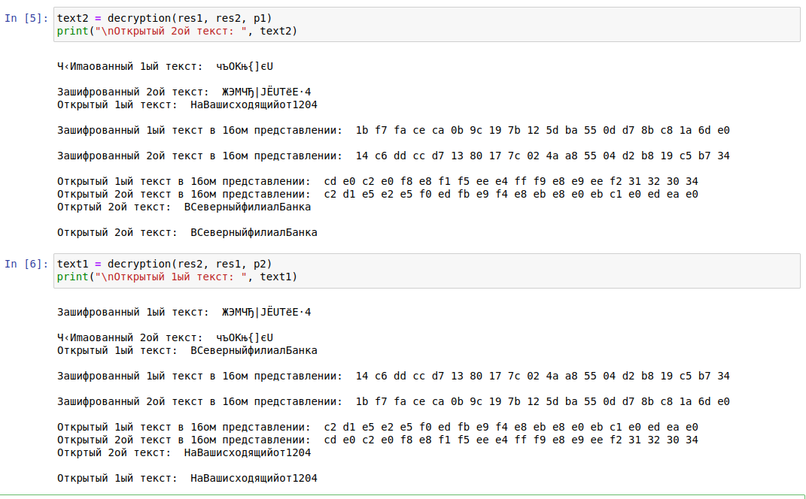

---
## Front matter
lang: ru-RU
title: Лабораторная работа №8
author: |
	Бешкуров Михаил
date: 17.12.2021

## Formatting
toc: false
slide_level: 2
theme: metropolis
header-includes: 
 - \metroset{progressbar=frametitle,sectionpage=progressbar,numbering=fraction}
 - '\makeatletter'
 - '\beamer@ignorenonframefalse'
 - '\makeatother'
aspectratio: 43
section-titles: true
---

# Элементы криптографии. Шифрование (кодирование) различных исходных текстов одним ключом

## Прагматика выполнения

- Криптография - наука о методах шифрования. Умение шифровать различные исходные тексты одним ключом является необходимым для дальнейшего знакомства с криптографией. 

## Цель выполнения лабораторной работы

- Освоить на практике применение режима однократного гаммирования на примере кодирования различных исходных текстов одним ключом

## Задачи выолнения работы

- Написать программу, которая должна определять вид шифротекстов при известных открытых текстах и при известном ключе.
- Также эта программа должна определить вид одного из текстов, зная вид другого открытого текста и  зашифрованный вид обоих текстов (т.е. не нужно использовать ключ при дешифровке).

## Результаты выполнения лабораторной работы

- Написал функцию шифрования, которая определяет вид шифротекста при известном ключе и известных открытых текстах "НаВашисходящийот1204" и "ВСеверныйфилиалБанка". Ниже представлены функция, шифрующая данные (рис - @fig:001), а также работа данной функции (рис - @fig:002).

##

{ #fig:001 width=70% }

##

{ #fig:002 width=70% }

##

- Написал функцию дешифровки, которая определяет вид одного из текстов, зная вид другого открытого текста и  зашифрованный вид обоих текстов (т.е. не испольузет ключ). (рис - @fig:003). А также представил результаты работы программы (рис - @fig:004).

{ #fig:003 width=70% }

##

{ #fig:004 width=70% }

##

Таким образом, я освоил на практике применение режима однократного гаммирования на примере кодирования различных исходных текстов одним ключом.
